# 🤖 UR Robot ProfiNet Setup (with Siemens TIA Portal)

This guide provides step-by-step instructions for setting up **ProfiNet communication between a Universal Robots (UR) robot and a Siemens PLC** using TIA Portal.

---

## Overview

ProfiNet allows efficient Ethernet-based I/O communication between devices like PLCs and robots. Unlike wiring each signal separately, all data is transmitted over a single network cable.

- **EtherNet/IP** is commonly used with Rockwell/Allen-Bradley  
- **ProfiNet** is typically used with Siemens systems

---

## UR Robot Setup

### 1. Configure Network

- Open the **hamburger menu** on the UR teach pendant and go to **Settings > System > Network**
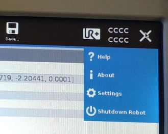

- Open the system->network tab
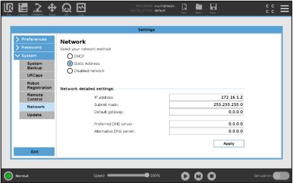

- Change to **Static IP**
- Set the IP address to match the PLC’s subnet (typically: `255.255.255.0`)
- Apply and exit

### 2. Enable ProfiNet

- Go to **Installation > Fieldbus > ProfiNet**
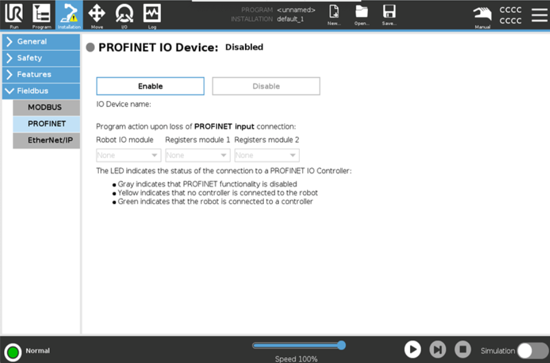
- Toggle ProfiNet **On**
- A **yellow circle** means it's active
- It may turn **green** if your PLC is already configured
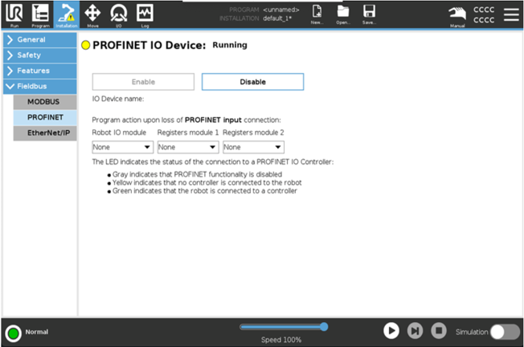

---

## Siemens TIA Portal Setup

### 1. Assign IP and Device Name

- In **Project View**, go to **Online Access**
- Select your network adapter
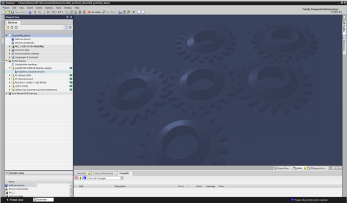
- Under **Online & Diagnostics**, go to **Assign IP Address**
  - Set desired IP
  - Assign ProfiNet device name
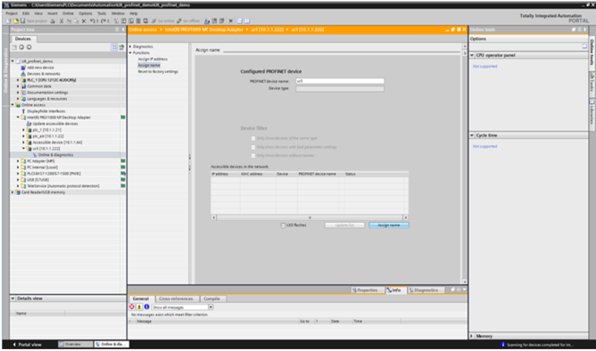

### 2. Import GSD File

- Go to **Options > Manage General Station Description Files (GSD)**
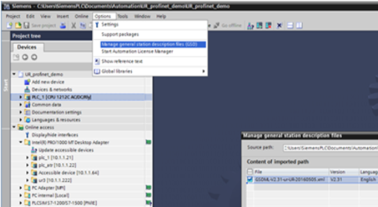
- Download the GSD from:  
  https://www.universal-robots.com/articles/ur/interface-communication/profinet-how-to-guide-cb3/

### 3. Add UR Robot to Network

- Open **Devices and Networks**
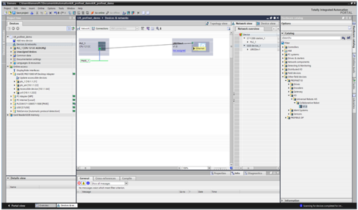
- Drag UR device from:  
  `Other Field Devices > ProfiNet IO > I/O > Universal Robots A/S > Collaborative Robot V1.0`
- Connect PLC and UR device in the network view

### 4. Configure Modules

- Double-click UR device in the network view
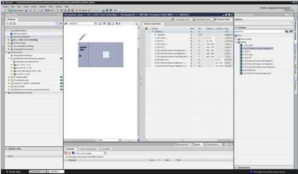
- Drag modules from **Catalog > Module** to corresponding slots
- Note assigned I (input) and Q (output) addresses

### 5. IP Address and Device Name

- Under **General > Ethernet Address**, set the same IP as in step 1
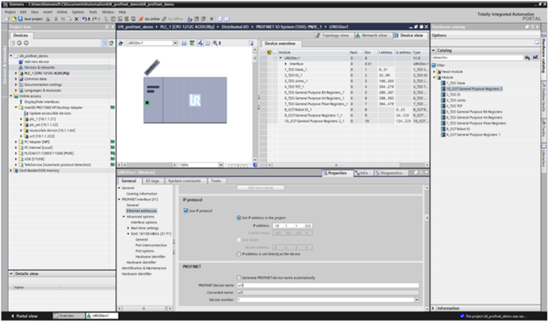
- Uncheck **Generate ProfiNet Device Name Automatically**
- Use the exact device name previously assigned

### 6. Import Data Types

- In **Project Tree > External Source Files**, add `UR_datastruct.udt`
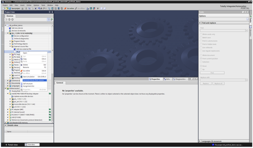
- Right-click it and select **Generate Blocks from Source**

### 7. Create PLC Tags
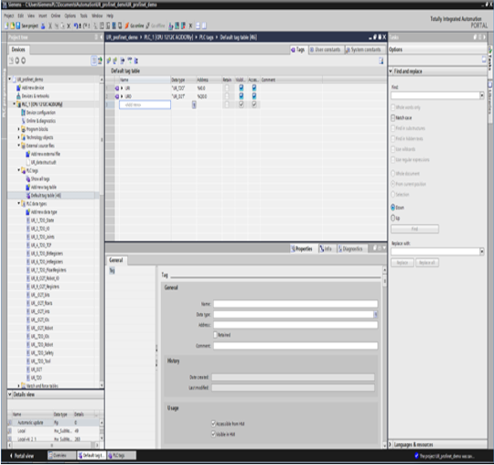

- In **PLC Tags**, create tags matching the enabled modules
- Recommended:
  - `UR_T20` for input (robot ➝ PLC)
  - `UR_O2T` for output (PLC ➝ robot)

---

## Download to PLC
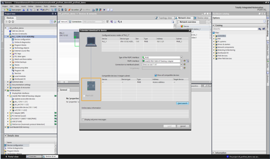

- Click the **Download icon**
- Tap **Start Search** and select your PLC
- Click **Load**
- Ensure all modules/tags show **green**
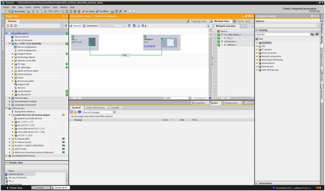

---

## Final Checks

### On the UR Robot
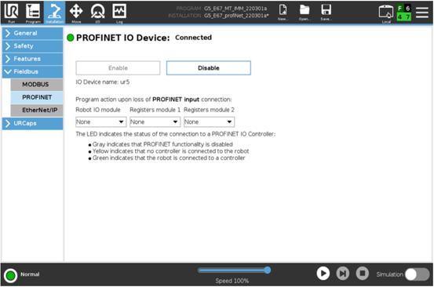

- In **Installation > Fieldbus > ProfiNet**, verify LED is **green**

### On the PLC

- Open **Tag Table**
- Expand your input tag to view data from the robot
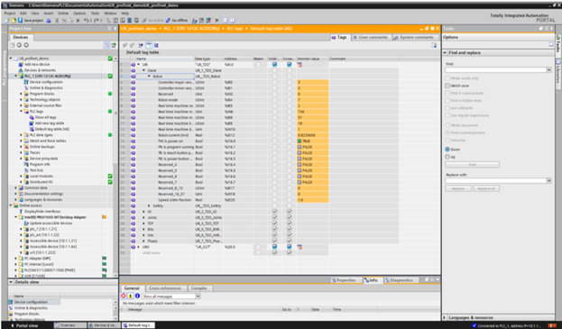

---

## Robot Programming

### Script Commands

Use assignment or script lines (under **Advanced** tab):

```ur
write_output_integer_register(0, 1)
read_input_integer_register(0)
```


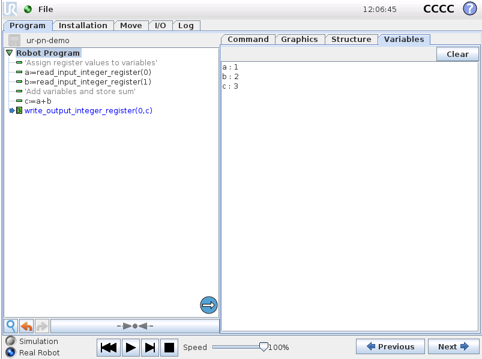
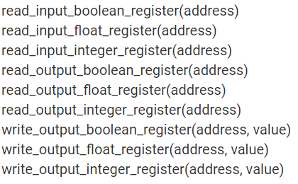

> Tip: Plug a keyboard into the USB port on the teach pendant to type faster.

---

### Named I/O (Optional)

- Go to **Installation > I/O Setup**
- Give names to each ProfiNet IO point
- Use **Set** or **Wait** commands under **Basic** tab for control logic
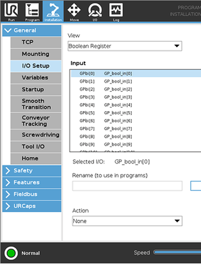

---

## Save Installation

- Use the **Save I/O** button in the middle of the screen to save the current I/O configuration

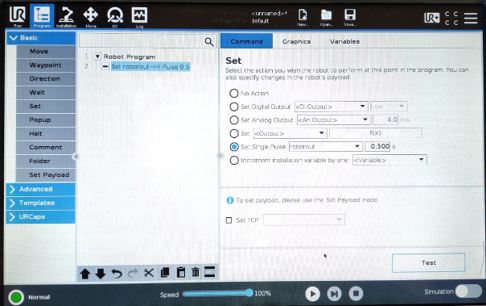

---

### Additional Files

- UR GSD file (from UR website)
- `UR_datastruct.udt` for Siemens