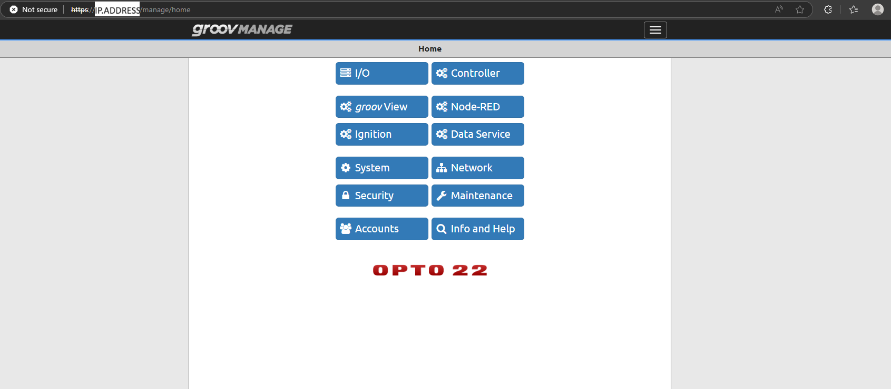

# **Getting Started with MQTT on groov EPIC**

## **Part 1: Set Up groov EPIC**

### **Step 1: Connect the groov EPIC to the Network**

Start by connecting your groov EPIC device to your local network. You can use either Wi-Fi or Ethernet, depending on your setup.

  

### **Step 2: Find the IP Address**

Once connected, identify the IP address of your groov EPIC. In this example, the IP address is: IP.ADDRESS

  

  

This address allows you to access the device from your computer. Open a web browser and enter the IP address: [http://IP.ADDRESS](http://IP.ADDRESS/)

You will be directed to the login page of the groov EPIC interface.

  

### **Step 3: Log In to the groov EPIC Interface**

Use the following credentials to log in:

| Username | USERNAME |
| --- | --- |
| Password | PASSWORD |

  

### **Step 4: View the Main Menu**

After logging in, you will see the groov EPIC main system menu.

  

### **Step 5: Open Node-RED**

From the main menu:

Select the Node-RED option.

Click on "Open Node-RED Editor".

  

  

You are now inside the Node-RED editor, ready to build and configure MQTT flows on your groov EPIC.

  

## Part 2: Building the TCP/IP Flow

### Step 1: Add an Inject Node
In the left sidebar, under the input section, find the Inject node.

Drag it into the workspace.

Double-click the node to configure it:

Set Payload type to: string

Enter the Value: hello!

Click Done.

  

### Step 2: Add a TCP Out Node
Under the output section, find the TCP out node.

Drag it next to the Inject node.

Double-click it to configure:

Type: connect to

Host: localhost

Port: 9000 (you can use a different port if needed)

Output: stream of characters

Click Done.

  

Connect the Inject node to the TCP out node by dragging from the gray dot.

### Step 3: Add a TCP In Node
Under the input section, drag a TCP in node into the workspace.

Double-click to configure:

Type: listen on

Port: 9000 (must match the TCP out node)

Output: stream of String

  

Click Done.

### Step 4: Add a Debug Node
Under the output section, find and drag a Debug node next to the TCP in node.

Double-click it:

Ensure Output is set to: msg.payload

Click Done.

  

Connect the TCP in node to the Debug node.

### Step 5: Deploy the Flow

Click the red Deploy button in the top-right corner to activate your flow.

  

Run your Flow

  

