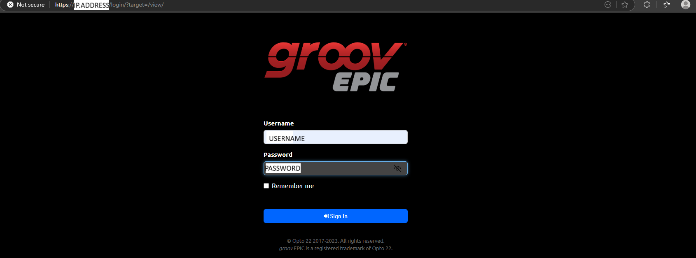
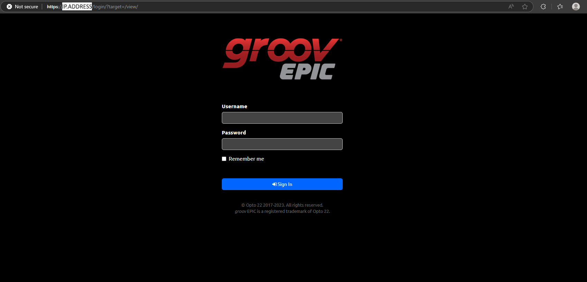
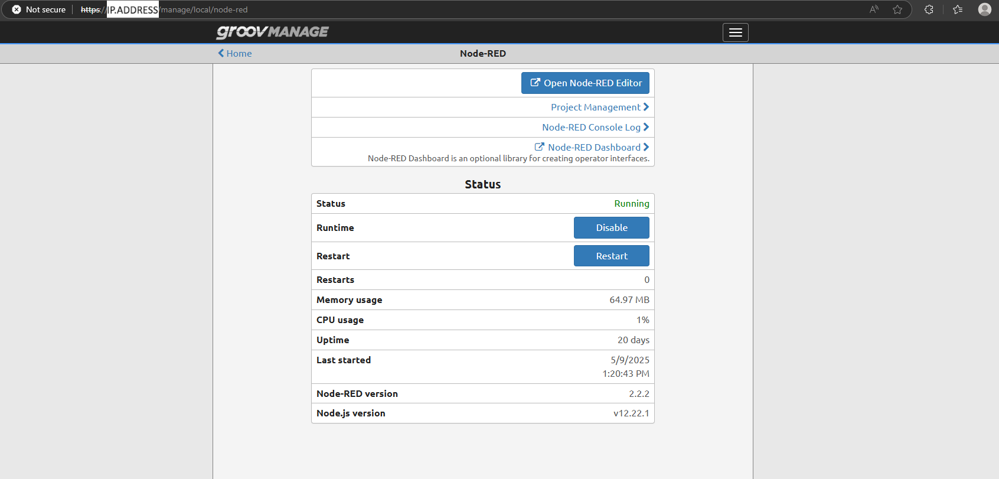
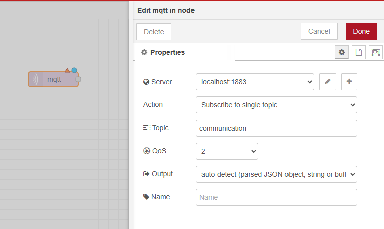
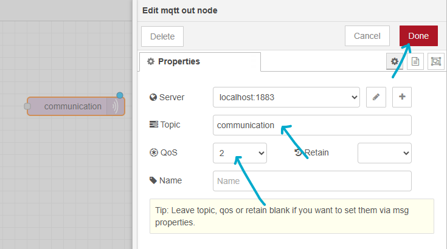

# Getting Started with MQTT on groov EPIC

## Part 1: Set Up groov EPIC

### Step 1: Connect the groov EPIC to the Network
Start by connecting your groov EPIC device to your local network.
You can use either Wi-Fi or Ethernet, depending on your setup.

  

### Step 2: Find the IP Address
Once connected, identify the IP address of your groov EPIC.
In this example, the IP address is: ip.of.the.plc

  

  

This address allows you to access the device from your computer.
Open a web browser and enter the IP address:
http://ip.of.the.plc

You will be directed to the login page of the groov EPIC interface.

  

### Step 3: Log In to the groov EPIC Interface
Use the following credentials to log in:

  <table>
    <tr>
      <th>Username</th>
      <th>EXAMPLE USERNAME</th>
    </tr>
    <tr>
      <td>Password</td>
      <td>EXAMPLE PASSWORD</td>
    </tr>
  </table>

  

### Step 4: View the Main Menu
After logging in, you will see the groov EPIC main system menu.

  

### Step 5: Open Node-RED
From the main menu:

Select the Node-RED option.

Click on "Open Node-RED Editor".

  

You are now inside the Node-RED editor, ready to build and configure MQTT flows on your groov EPIC.

  

## Part 2: Building the MQTT Flow

### Step 1: Add an Inject Node
In the left sidebar, under the "input" section, locate the Inject node.

Drag it into the Node-RED workspace.

Double-click the node to configure it:

Set the Payload type to: string

Enter the Value: hello!

Click Done.

  

### Step 2: Add an MQTT Out Node
Under the "output" section, find the MQTT out node.

Drag it next to the Inject node.

Double-click the MQTT out node to configure it:

  

Click the pencil icon next to the Server field to add a new broker.

In the configuration window:

Server: localhost

Port: 1883

Click Add

Back in the node settings:

Set the Topic to: communication

Set QoS (Quality of Service) to: 2

Click Done.

Connect the Inject node to the MQTT out node by dragging from the gray dot.

  

  

  

  

### Step 3: Add an MQTT In Node
From the "input" section, drag an MQTT in node into the workspace.

Double-click it to configure:

Use the same broker: localhost:1883

Set the Topic to: communication

Set QoS to: 2

Click Done.

  

### Step 4: Add a Debug Node
Under the "output" section, find and drag a Debug node next to the MQTT in node.

Double-click it:

Make sure the Output is set to: msg.payload

Click Done.

  

Connect the MQTT in node to the Debug node.

  

### Step 5: Deploy the Flow
Click the red "Deploy" button in the upper-right corner to activate your flow.

  

#### Flow Overview
The Inject node manually sends a message (hello!)

The MQTT Out node publishes that message to the topic: communication

The MQTT In node subscribes to the same topic (communication)

The Debug node displays the message output in the Node-RED debug sidebar
