# Siemens MQTT

Step-by-step guide to implementing **MQTT** communication on **Siemens** devices using **TIA Portal** and the `LMQTT_Client` library.

## Part 1: Create a Siemens account

1. Go to: 👉 [https://support.industry.siemens.com](https://support.industry.siemens.com/)
2. In the top-right corner, click **“Register”**.
3. Fill in your details (name, email, country, etc.).
4. Check your email to confirm the registration.
5. Log in to the portal using your new account.

  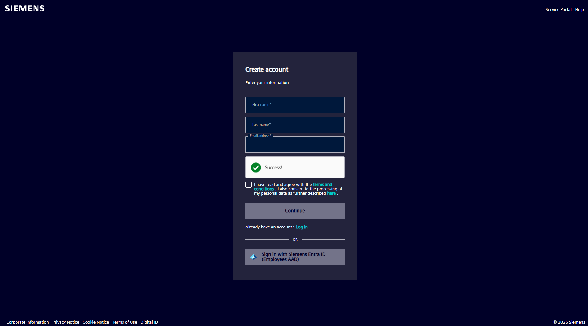

---

## Part 2: Download the communication library

1. Visit the official Siemens support page for the communication libraries:
    
    https://support.industry.siemens.com/cs/document/109780503
    
2. Scroll down to the **“Download”** section.
3. Select the appropriate version for your installed TIA Portal
4. Click the **download icon**.
5. Accept the license terms if prompted.
6. Download and unzip the archive on your computer.

  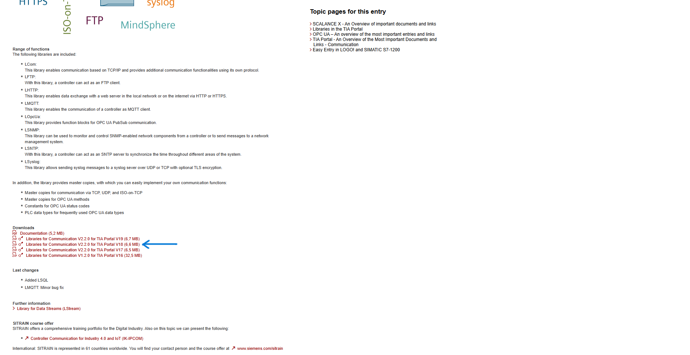

  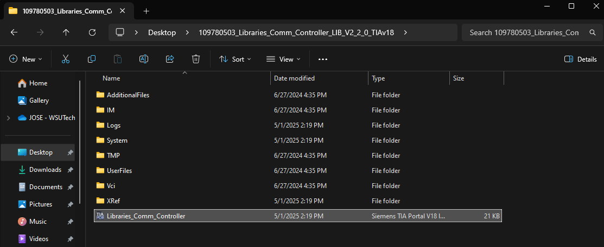

---

## Part 3: Import the library into TIA Portal

1. Open your project in **TIA Portal**.
2. Go to the **“Project Library”** panel.
3. Right-click and select: **Manage libraries** → **Open library**.
4. Browse for the `.al#` file you downloaded. (# represents the version of Tia in use) 
5. The library will open as a **Global Library**.
6. From there, you can drag and drop function blocks, data types, and other components into your project.

  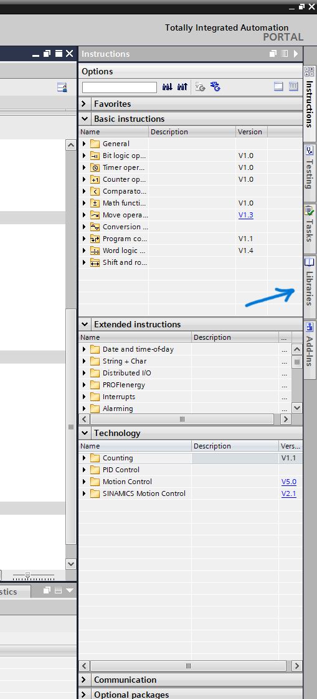

  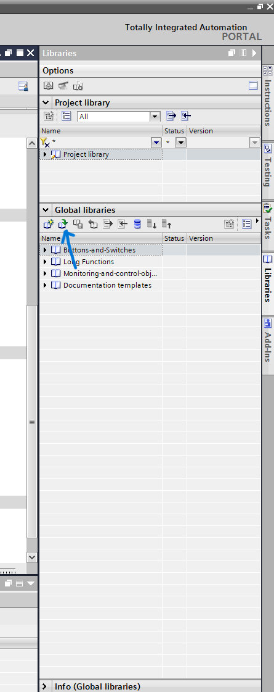

  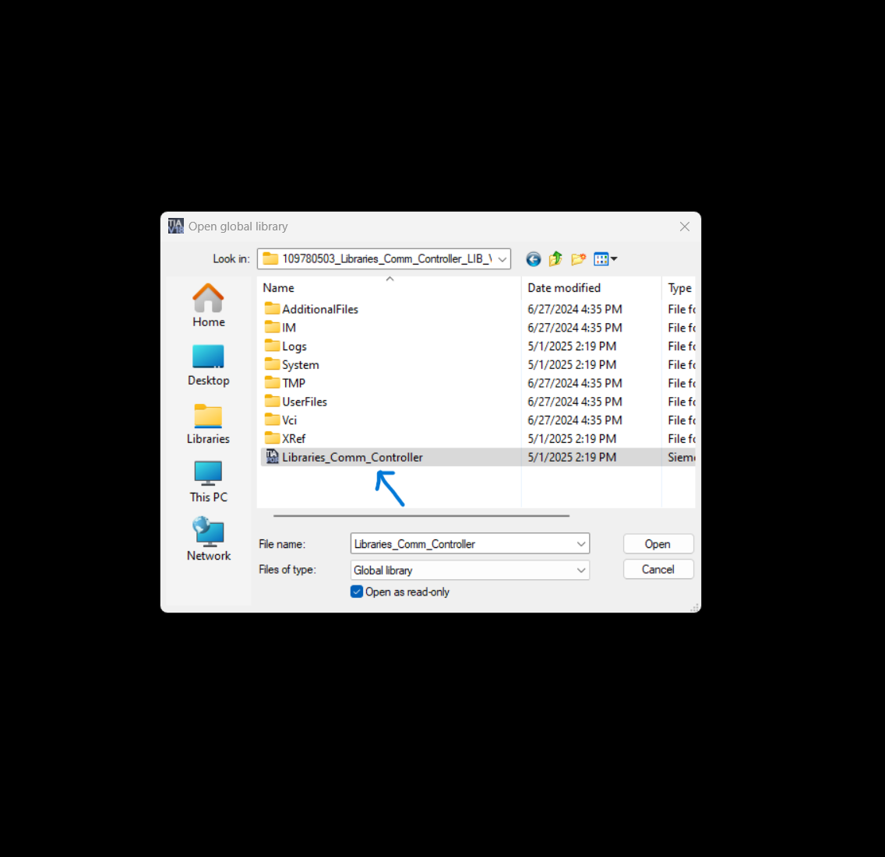

  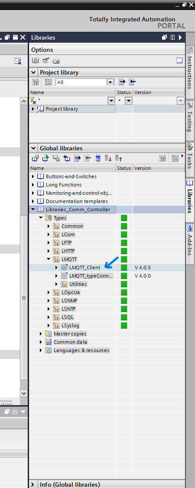

---

## Part 4: Set-Up **LMQTT_Client FB**

### a) Add the LMQTT_Client FB to a Network**

1. Open **TIA Portal** and navigate to the program block where you want to implement MQTT communication.
2. In an empty network, insert a new **Function Block (FB)**.
3. Search for and select: `LMQTT_Client`.
4. When prompted, create an associated Data Block for the FB.
5. Accept the default name: `LMQTT_Client_DB`.

  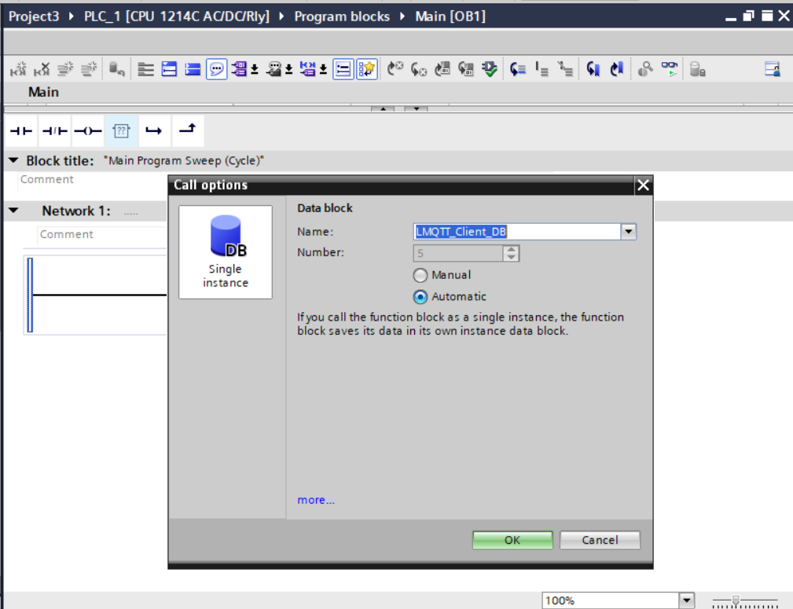

  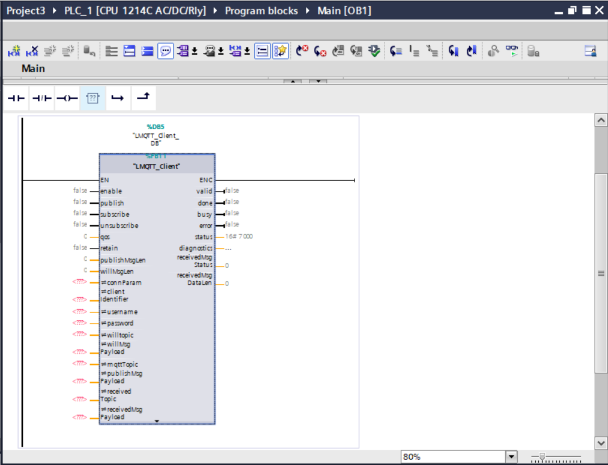

---

### b) Create a New Data Block for Parameters

1. Go to **Program blocks** → right-click → **Add new block**.
2. Choose **Data Block**.
3. Name it as desired (e.g., Data_block_MQTT).

  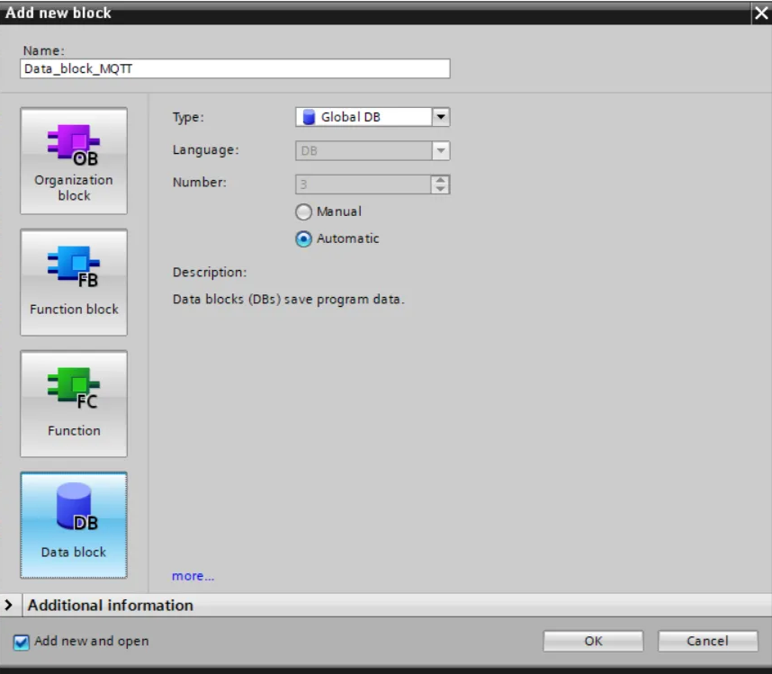

---

### c) Open the Data Block and add the following variables:
FULL TAGS:

| Alias	               | Type                     |
|----------------------|--------------------------|
| enable               | Bool                     |
| publish              | Bool                     |
| subscribe            | Bool                     |
| unsubscribe          | Bool                     |
| qos                  | USInt                    |
| retain               | Bool                     |
| publishMsgLen        | 100                      |
| willMsgLen           | 100                      |
| connParam            | "LMQTT_typeConnParam"    |
| clientID             | WString                  |
| username             | WString                  |
| password             | WString                  |
| willtopic            | WString                  |
| willMsgPayload       | Array[0..99] of Byte     |
| mqttTopic            | WString                  |
| publishMsgPayload    | Array[0..99] of Byte     |
| receivedTopic        | WString                  |
| receivedMsgPayload   | Array[0..99] of Byte     |
| valid                | Bool                     |
| done                 | Bool                     |
| busy                 | Bool                     |
| error                | Bool                     |
| status               | Word                     |
| diagnostics          | "typeDiagnostics"        |
| receivedMsgStatus    | USInt                    |
| receivedMsgDataLen   | UDint                    |

  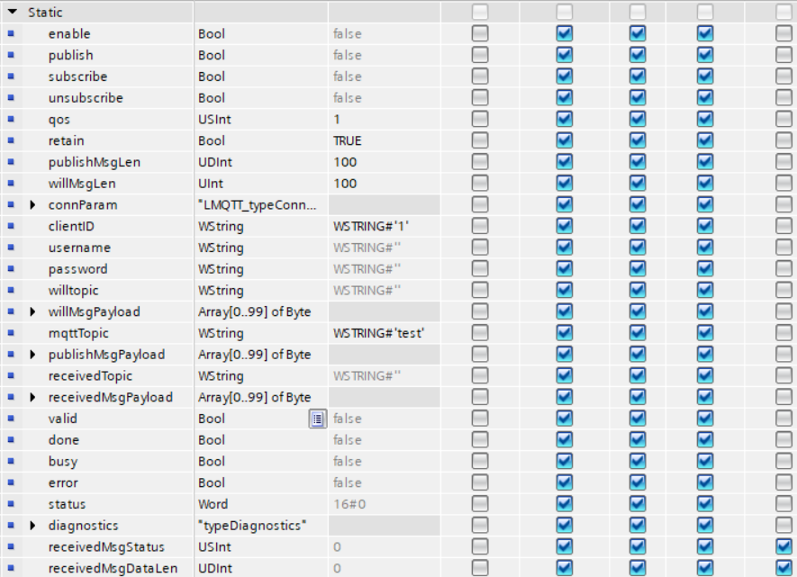

---

### d) Set up the variables values as:

QoS = 1 (publishing accepts 2 but subscribing only 1)

Retain = 1

willMsgLen=100

mqttTopic=test ( feel free to use other topic)

### e) Now, on connParam, set up the ip and the port of our broker

  

---

## Part 5: Link the Variables to the FB
1. Return to the network where the `LMQTT_Client` FB is located.
2. Connect each FB parameter to the corresponding variable in the `Block_IoT_MQTT`.
3. Ensure proper assignment:

  

  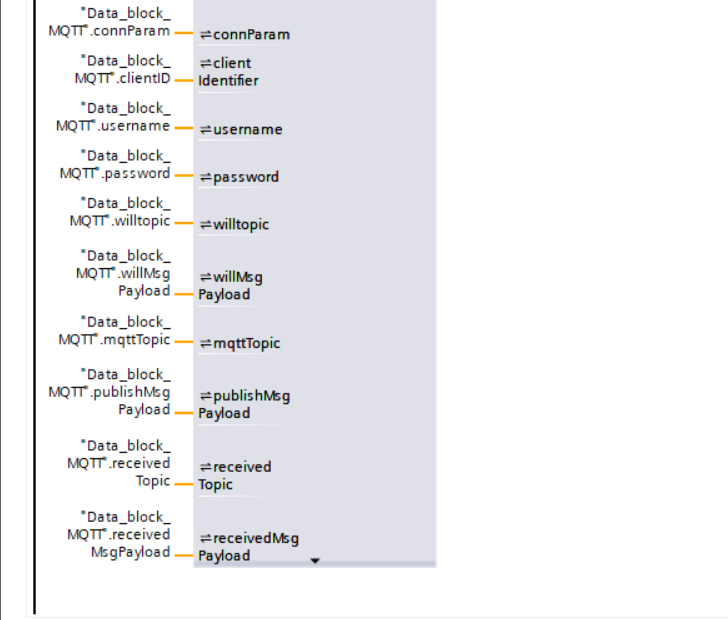

#### **Recommendation**

For detailed information about each parameter's behavior, refer to the official documentation provided by Siemens on the download page for the **LMQTT_Client** library.
---

## Part 6: Create a Watch and Force tables

  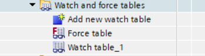

Add the following variables into the Watch table

  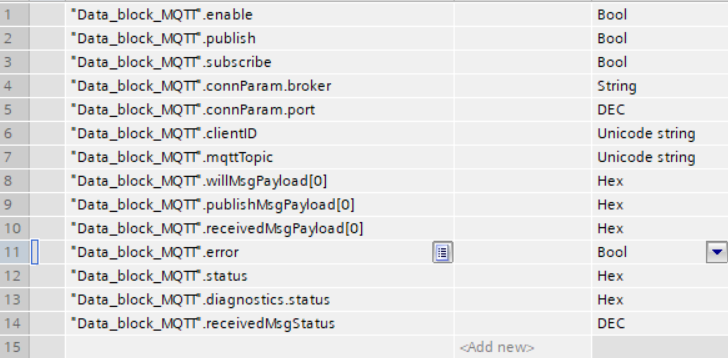

Download and lets test, and monitor all in the watch table

  

In “publishMsgPayload”, you can choose the type of variable you want to send. For this example, leave it set to HEX. We’ll publish the character “A”, which corresponds to 16#41, so replace 16#00 with 16#41.
Make sure the mqttTopic is set to 'test'. Then, click Modify, and set the values to 1 or True for “enable: and “publish”.

Now check the subscriber to see if it received the message.

  

To receive data, just publish the desired information externally, like this:

  

Check the receivedMsgPayload in the Watch table. The value should change from 16#00 to 16#42, which corresponds to the character B.

  

---